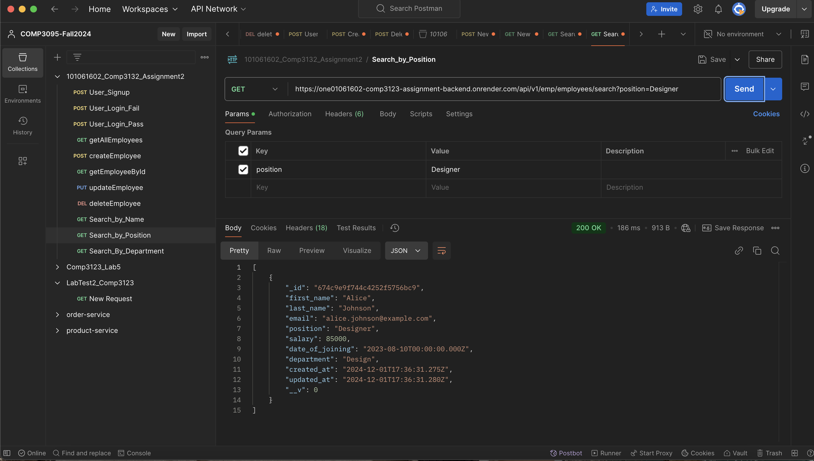
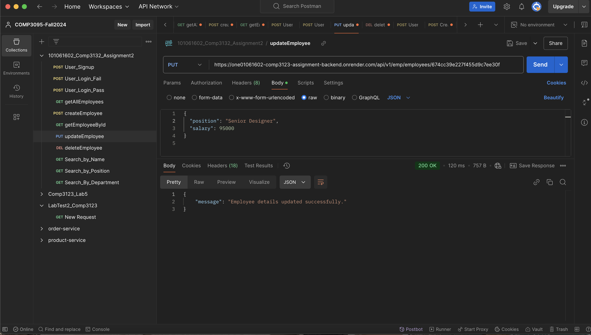
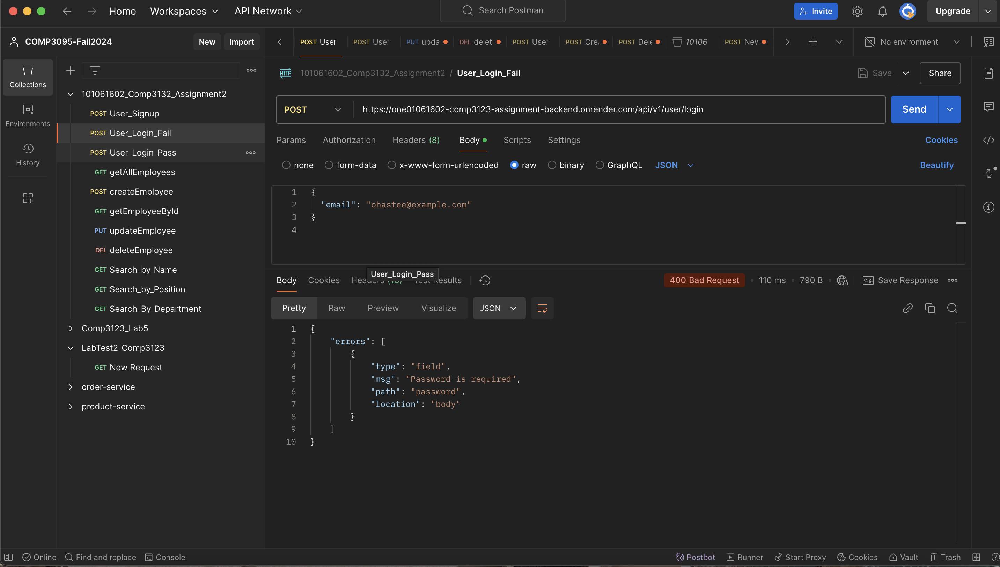
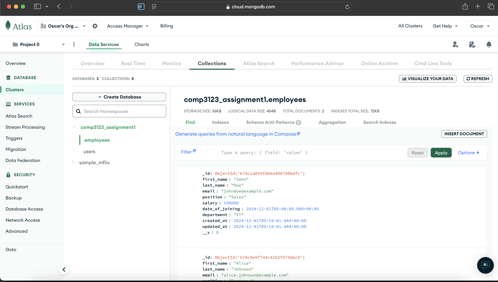

# Employee Management System

This project is a full-stack web application for managing employees. It allows users to perform CRUD (Create, Read, Update, Delete) operations, search for employees by various criteria, and manage user authentication.

## Technologies Used

- **Frontend**: React.js
  - Hosted on **Netlify** at: [Employee Management Frontend](https://fascinating-medovik-a5e6dc.netlify.app/)
- **Backend**: Node.js with Express
  - Hosted on **Render** at: [Employee Management Backend](https://one01061602-comp3123-assignment-backend.onrender.com)
- **Database**: MongoDB Atlas

---

## Features

- User authentication (Signup and Login).
- Add, view, update, and delete employees.
- Search employees by:
  - Name
  - Position
  - Department
- Responsive UI/UX using **Material-UI**.
- Breadcrumb navigation for better user experience.
- Fully integrated frontend and backend with API connectivity.

---

## How to Use

### Frontend
The frontend is hosted on Netlify and can be accessed [here](https://fascinating-medovik-a5e6dc.netlify.app/).

### Backend
The backend APIs are hosted on Render and can be accessed [here](https://one01061602-comp3123-assignment-backend.onrender.com).

### Database
The application uses MongoDB Atlas for database storage. The backend connects to this remote database using `MONGODB_URI_REMOTE`.

---

## API Endpoints

### User Routes
- **POST** `/api/v1/user/signup` - User signup.
- **POST** `/api/v1/user/login` - User login.

### Employee Routes
- **GET** `/api/v1/emp/employees` - Get all employees.
- **POST** `/api/v1/emp/employees` - Add a new employee.
- **GET** `/api/v1/emp/employees/:eid` - Get employee details by ID.
- **PUT** `/api/v1/emp/employees/:eid` - Update an employee.
- **DELETE** `/api/v1/emp/employees` - Delete an employee using the query parameter `eid`.
- **GET** `/api/v1/emp/employees/search` - Search employees by:
  - `name`
  - `position`
  - `department`

---

## Screenshots

Below are screenshots of the application:

### Signup Page

### Login Page

### Employee List Page

### AddEmployee Page

### Employee Details Page

### Update Employee Page

### Delete Popup

### Create Employee

### Delete Employee

### Get All Employees

### Get Employee by ID

### Search by Department

### Search by Name

### Search by Position

### Update Employee

### User Login Fail

### User Login Pass

### User Signup

### MongoDB Data

### Netlify Deploy Log

### Render Build Part 1

### Render Build Part 2

---

## How to Run Locally

1. Clone the repository: `git clone https://github.com/oHastee/101061602_COMP3123_Assignment1`
2. Navigate to the frontend and backend directories and install dependencies:
   - For frontend: `npm install`
   - For backend: `npm install`
3. Create `.env` files in both directories with appropriate configurations.
4. Start the backend server: `npm start` in the backend directory.
5. Start the frontend: `npm start` in the frontend directory.

---

## Deployment

### Frontend
The frontend is deployed using **Netlify**. Visit the [Netlify dashboard](https://app.netlify.com/) to manage the deployment.

### Backend
The backend is deployed using **Render**. Visit the [Render dashboard](https://dashboard.render.com/) to manage the deployment.

---

## Authors

This project was created by Oscar Piedrasanta Diaz as part of COMP3123 at George Brown College.

